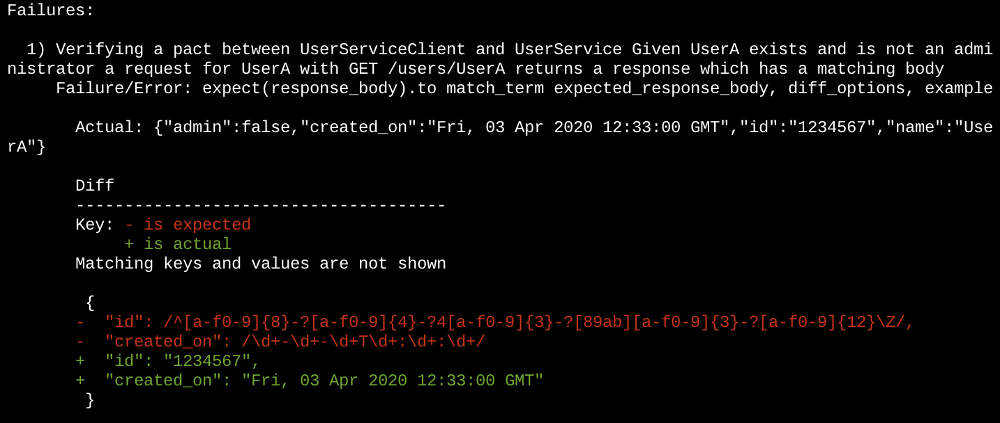

# Introduction

This is an e2e example using flask to help as a guide to getting started with Pact for Python

## Setup

Create your own virtualenv for this. Run

```bash
pip install -r requirements.txt
```

Create the local broker (for demo purposes only) To do this separately clone this repo:
* https://github.com/pact-foundation/pact-broker-docker

Then from where this is install run in it's own terminal

```bash
docker-compose up
```

If you can open a browser to http://localhost and see the broker you have succeeded.

## Consumer

From the root directory run:

```bash
pytest
```

Or you can run individual tests like:

```bash
pytest tests/test_user_consumer.py::test_get_non_existing_user
```

Sometimes you may get the mock server in a hung state. You can kill it via (untested):

```bash
pkill -f pact-mock-service.rb
```

## Provider States

Start the provider app in one window:

```bash
python provider.py
```

Then run the script (placeholder version number for pact broker)

```bash
./verify_pact.sh 1
```

You should see this fails with output like this:



To resolve this if you look in the provider.py you will see the working values.

```python
def setup_user_a_nonadmin():
    broken_id = '1234567'
    working_id = '00000000-0000-4000-a000-000000000000'
    broken_date = datetime.datetime.now()
    working_date = '2016-12-15T20:16:01'

```

Switch these around in the subsequent dict and re-run.

### Provider debugging

To manually trigger one of the 2 manual states you can run:

```bash
curl -X POST -H "Content-Type: application/json"  --data "{\"state\": \"UserA exists and is not an administrator\"}" http://127.0.0.1:5000/_pact/provider_states
```

Changing the json content to match the state you want.
